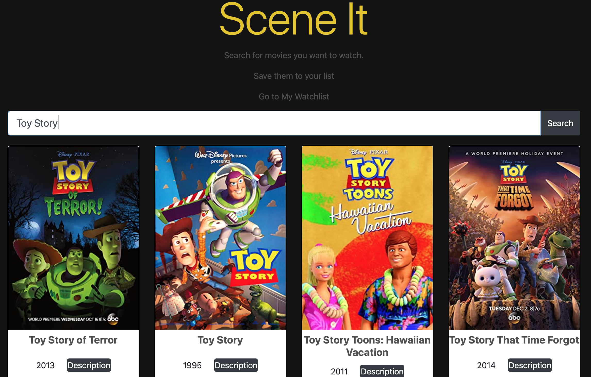

# Scene It: Movie App
> Search for your favorite movies and add them to your watchlist!

## Table of contents
* [General info](#general-info)
* [Technologies](#technologies)
* [Features](#features)
* [Demo](#Demo)

## General info
This app is a simple tool for searching for movies, saving the ones you want to watch, and later removing them from your watchlist after you watch them. When users search for movies, "Scene It" uses AJAX to make requests to an external API (application programming interface) called OMDb. I built the app to sharpen my skills in rendering data to the DOM (Document Object Model) and to learn more about how the user interface consume's data from the OMDb API.

## Technologies
* HTML-5
* CSS-3
* Javascript
* AJAX
* Bootstrap-4
* OMDb API
* jQuery
* Json
* Axios

## Features
* Search bar- Search for your favorite movies.
* Decription - Click the description button to learn more about the selected title.
* Add to watchlist buttton - Adds movies to your watchlist.
* Watchlist - View all of your saved movies.
* Remove from watchlist button - Deletes the selected movies from your watchlist page.
* IMDb ratings - View the movies ratings.

## Demo
https://fav-films.netlify.app
